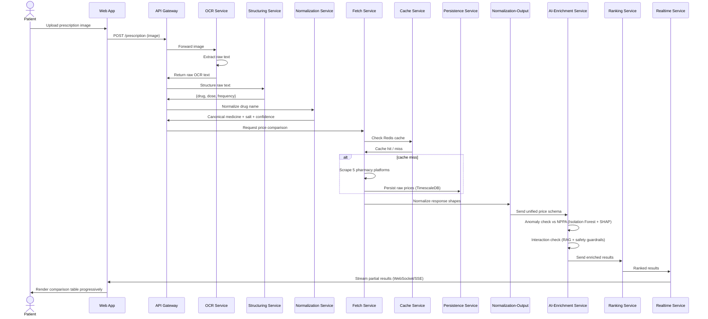

# Data Flow Sequence

This document describes the end-to-end request sequence for the core Medkart.ai workflow: prescription upload through to a ranked, streamed price comparison with safety annotations.

## Sequence: Prescription Upload → Ranked Comparison

```
Patient          →  Web App
Web App          →  API Gateway         : POST /prescription (image)
API Gateway      →  OCR Service         : forward image
OCR Service      →  OCR Service         : extract raw text
OCR Service      →  API Gateway         : return raw OCR text
API Gateway      →  Structuring Service : structure raw text
Structuring Svc  →  API Gateway         : return {drug, dose, frequency}
API Gateway      →  Normalization Svc   : normalize drug name
Normalization Svc→  API Gateway         : canonical medicine + salt + confidence
API Gateway      →  Fetch Service       : request price comparison
Fetch Service    →  Cache Service       : check Redis cache
Cache Service    →  Fetch Service       : cache hit / miss
Fetch Service    →  Pharmacy Platforms  : (on cache miss) scrape 5 platforms
Fetch Service    →  Persistence Service : persist raw prices (TimescaleDB)
Fetch Service    →  Normalization-Output: normalize response shapes
Normalization-Out→  AI-Enrichment Svc   : send unified schema
AI-Enrichment Svc→  AI-Enrichment Svc   : anomaly check vs NPPA (Isolation Forest + SHAP)
AI-Enrichment Svc→  AI-Enrichment Svc   : interaction check (RAG + safety guardrails)
AI-Enrichment Svc→  Ranking Service     : send enriched results
Ranking Service  →  Realtime Service    : ranked results
Realtime Service →  Web App             : stream partial results (WebSocket/SSE)
Web App          →  Patient             : render comparison table as results arrive
```

## Step-by-Step Description

1. **Upload** — Patient uploads a prescription image via the web app (or bypasses this step with a direct medicine-name search, per FR-6).
2. **Gateway routing** — API Gateway authenticates the request (JWT, per FR-2/NFR-8) and forwards the image to `ocr-service`.
3. **OCR extraction** — `ocr-service` extracts raw text from the image (FR-5) and returns it to the gateway.
4. **Structuring** — `prescription-structuring-service` uses an LLM to convert raw text into structured `{drug, dosage, frequency}` fields (FR-7), returning a schema-validated object.
5. **Normalization** — `normalization-service` fuzzy-matches the extracted drug name against the canonical catalog, resolves it to an active salt, and logs the match confidence (FR-8/9/10, NFR-13). Low-confidence matches are flagged rather than silently accepted.
6. **Cache check** — `fetch-service` asks `cache-service` (Redis) whether a recent price exists for this medicine before scraping (FR-14).
7. **Live fetch (on cache miss)** — `fetch-service` routes each of the five platforms to a static scraper or headless browser as appropriate (FR-12), applying anti-bot measures (FR-13), and falls back to seed/cached data if a platform is unreachable (FR-15, NFR-5).
8. **Persistence** — Every fetched price is written as a timestamped record to a TimescaleDB hypertable (FR-25).
9. **Schema unification** — `normalization-output-service` maps all five platforms' differing response shapes into one unified schema (FR-16).
10. **AI enrichment** — `ai-enrichment-service` runs the Isolation Forest anomaly check against the NPPA ceiling price and generates a SHAP explanation for any flagged price (FR-17/18); in parallel, it checks the patient's medicines against the drug-interaction table and generates an LLM-based warning, filtered through a safety guardrail (FR-20/21).
11. **Ranking** — `ranking-service` scores and orders the five platform results by a weighted combination of price, discount, delivery estimate, and stock status (FR-22).
12. **Streaming** — `realtime-service` pushes results to the client progressively as each platform's data becomes available, rather than blocking on the slowest platform (FR-24).
13. **Render** — The web app renders the comparison table incrementally, highlighting the cheapest verified option and surfacing any anomaly or interaction warnings inline (FR-23).

## Sequence Diagram (Mermaid)

If your documentation viewer supports Mermaid (GitHub renders this natively in `.md` files), this version renders as an actual diagram instead of ASCII art:



## Secondary Flow: Watchlist Alert

```
Patient       →  Alerts Service      : add medicine + target price
Alerts Service→  Persistence Service : persist to watchlists table
(scheduled job)  Alerts Service      : poll latest price via Persistence Service
Alerts Service→  Alerts Service      : if price <= target, trigger alert
Alerts Service→  Notification Channel: send email / SMS / push
Notification  →  Patient             : deliver alert
```

This flow runs independently of the live comparison request path (FR-27/28) and is triggered by a scheduled job (`alerts-service/jobs/check-alerts.ts`) rather than a user-initiated request.
